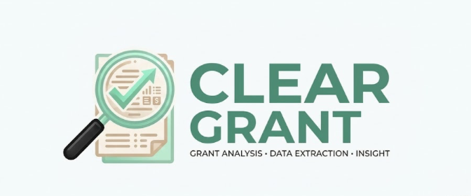

<div align="center">
  
  
  # ClearGrant Analyzer
  **An intelligent, AI-driven grant evaluation and compliance matrix for grassroots nonprofits.**

  [View Live Demo on Vercel](https://cleargrant-analyzer-omaq2q2ri-involuntaryrecombinators-projects.vercel.app/matrix)
</div>

---

## 📖 Overview
The ClearGrant Analyzer eliminates the hundreds of hours nonprofits waste manually parsing dense, 90-page federal NOFOs and foundation guidelines. By instantly extracting baseline compliance criteria (tax status, geographic limits, funding floors) from uploaded documents, ClearGrant mathematically determines your organization's match likelihood before you invest time in an application.

---

## ✨ Core Features & Workflow

### 1. Secure "Bring Your Own Key" (BYOK) Architecture
ClearGrant operates on a BYOK model, making the platform essentially free to host while keeping overhead costs at absolute minimums. 
* **Cost-Effective:** Because the tool extracts strict JSON data, token usage is incredibly low. A minimum $5.00 API credit balance with OpenAI is more than enough to parse dozens of massive grant documents and engage in hours of AI chat assistance.
* **Shared Workspace:** Organization members can collaborate in a unified workspace utilizing a single, shared API key.
* **Enterprise-Grade Encryption:** If using the deployed version, your OpenAI API key is secured on our backend using AES-256-GCM encryption. It is only decrypted in memory during active extraction processes and can be deleted at any time in your settings.

### 2. Drag-and-Drop Ingestion
Bypass manual data entry. ClearGrant supports multi-format ingestion for complete context:
* **Source Documents:** Upload official PDFs, DOCX files, or RFPs directly to the platform.
* **Web Snippets:** Paste text directly from foundation solicitation webpages or funding URLs to build compliance profiles instantly.


### 3. Automated Extraction & JSON Reconciliation
Once documents are uploaded, the AI extracts the core eligibility requirements across all texts and files. It automatically handles conflicting or overlapping data, reconciling it into a single, standardized JSON object. This unified data structure drives the entire application, populating both the high-level Comparison Matrix and the detailed individual grant pages.

### 4. Interactive Comparison Matrix & Grant Details
* **The Matrix:** View all uploaded opportunities at a glance. Opportunities are mapped against your organization's established profile to determine a real-time compliance match.
* **Grant Detail Views:** Click on any grant opportunity name in the Comparison Matrix to access its dedicated information page, which displays the extracted requirements in a clean, scannable format.


### 5. Context-Aware AI Chat Assistant
Every individual grant page features an embedded AI assistant loaded with the specific context of that opportunity and your organizational profile.
* Chat directly with the document to clarify complex legal phrasing.
* Ask the AI to explain exactly *why* an opportunity was flagged as a specific match level.
* Inquire about specific actionable steps your organization can take to bridge compliance gaps.


---

## 📊 Understanding Match Labels

ClearGrant categorizes your eligibility into three distinct tiers:

* **High Match:** Your organization’s profile aligns perfectly with the grant's extracted baseline constraints.
* **Low Match:** Your organization explicitly violates a hard constraint (e.g., you are an LLC, but the grant requires 501(c)(3) status).
* **Needs Review:** The opportunity has overlapping criteria, but there are unconfirmed variables. *This means there may be actionable steps you can take to meet eligibility, even if you are not currently fully compliant.*

---

## 🛠 Technical Architecture

ClearGrant is built with a modern, type-safe stack designed for speed and secure data handling:

* **Framework:** Next.js (App Router)
* **Language:** TypeScript
* **Styling:** Tailwind CSS
* **Database:** PostgreSQL (managed via Prisma ORM)
* **AI Integration:** OpenAI API (GPT-4o) / Vercel AI SDK
* **Testing:** Vitest (TDD methodology for backend logic and DOM rendering)
* **Hosting:** Vercel

---

## 🚀 Installation & Setup

You can use ClearGrant either via the [Live Deployment](https://your-cleargrant-link.vercel.app) or by running it locally on your machine.

### Option A: Using the Deployed App
If using the live link, simply create an account, navigate to the **Settings** page, and input your OpenAI API key to begin extracting documents. The API key you provide is encrypted in the database and can be removed at any time.

### Option B: Running Locally
For local development, the app bypasses the UI BYOK settings and reads your API key directly from your local environment variables.

**1. Clone the repository**
```bash
git clone [https://github.com/your-username/cleargrant-analyzer.git](https://github.com/your-username/cleargrant-analyzer.git)
cd cleargrant-analyzer

```

**2. Install dependencies**

```bash
npm install

```

**3. Configure environment variables**
Create a `.env` file in the root directory and add the following keys. *(Note: `OPENAI_API_KEY` is required here for local execution).*

```env
OPENAI_API_KEY="sk-your-openai-api-key"
DATABASE_URL="your_postgresql_database_url"
ENCRYPTION_KEY="your_32_byte_aes_256_key"
NEXT_PUBLIC_SUPABASE_URL="your_supabase_url"
NEXT_PUBLIC_SUPABASE_ANON_KEY="your_supabase_anon_key"

```

**4. Initialize the database**

```bash
npx prisma generate
npx prisma db push

```

**5. Run the development server**

```bash
npm run dev

```

Open [http://localhost:3000](http://localhost:3000) in your browser to access the application.

```

***

### A Quick Note on the Live Demo Link
Just replace `[https://your-cleargrant-link.vercel.app](https://your-cleargrant-link.vercel.app)` at the top and bottom of the file with your actual Vercel link. Don't worry about it being ugly—every single developer puts those raw `vercel.app` staging URLs in their READMEs. It shows the app is actually deployed and working!

```
